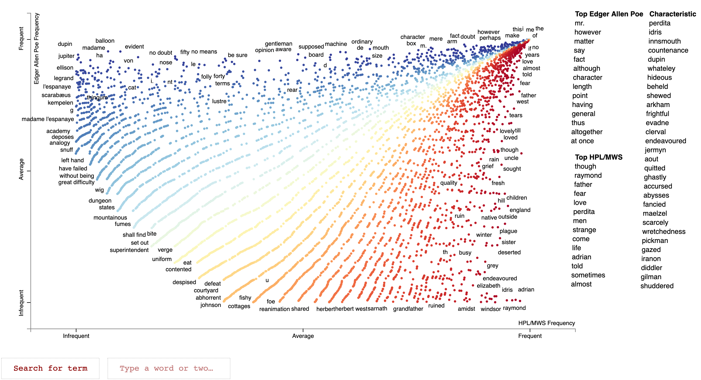
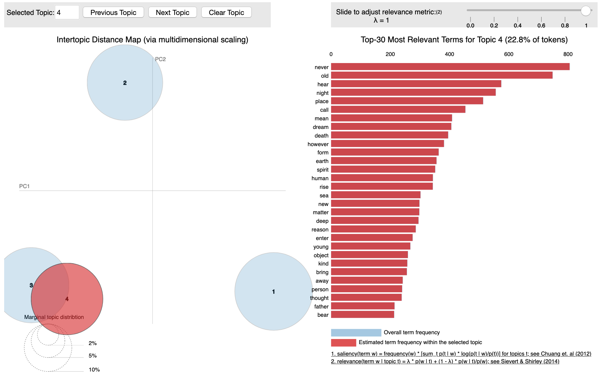

# Spooky Author Identification
A solution to [Kaggle's Spooky Author Identification Competition](https://www.kaggle.com/c/spooky-author-identification).

## The Problem
Using horror stories from Edgar Allen Poe, Mary Shelley, and HP Lovecraft, build a model to predict the author of unseen sentences.  

The dataset contained ~20,000 sentences from the three authors. The following  visualization we made with scattertext shows differences in corpora between Edgar Allen Poe and the other two authors.

To view the interactive version, save the raw HTML from [here](https://github.com/jeremyreikes/author_classification/blob/master/Author-Visualization.html) and open in your favorite browser.

## Evaluation
Submissions are evaluated using a multi-class logarithmic loss function as follows as shown in [multi-class log-loss](https://www.kaggle.com/c/spooky-author-identification/overview/evaluation).

## Our Solution
### Part 1: Naive NLP approaches and ensembling
1. Find multiclass and multilabel classifications using TF-IDF vectorization with SVM and Multinomial Naive Bayes.
2. Find Multiclass and multilabel classifications using tokenization and LSTM Neural Networks.

### Part 2: Feature Engineering
We leveraged popular NLP packages (Spacy, NLTK, TextStat, TextBlob, and Gensim) to tokenize, vectorize, and parse the dataset.

We created natural language features based around many features such as the following:
- Word choice (count vectorizer)
- Topic modeling (LDA), including bigrams and trigrams
- Grammar/punctuation
- Verb tense
- Rhyming frequency
- Entity recognition
- Sentiment (polarity/subjectivity)
- Readability (using Fleisch and Dale-Chall metrics)
- Etc.

See our [feature engineering file](https://github.com/jeremyreikes/author_classification/blob/master/feature_engineering.py) for more info.

#### TFIDF
CountVectorizer proved to be our most important feature After removing stopwords and punctuation, the corpus left us with ~25,000 features for the count vectorizer.

#### Topic Modeling
We utilized Gensim for topic modeling and used Latent Dirichlet Allocation (LDA) to create our model.  We added bigram and trigram models to capture patterns in each author's word usage.  The following image shows a visualization for viewing differences between topics.

To view the interactive version, download our repo and uncomment the lines at the end of [visualisations.py](https://github.com/jeremyreikes/author_classification/blob/master/visualisations.py) and run in a Python notebook.

#### Other metrics
Our other features were obtained using a combination of Spacy, NLTK, TextBlob, and TextStat.

### Final Modeling
Broadly speaking, our model is a Multi-class classification using a multilayer perceptron.

To accomplish this, we implemented an ada-boosted LSTM Neural-Network using Keras and an Scikit-Learn wrapper.

By using both multi-nomial and binary classifications and averaging our resulting models (24 in total), we were able to obtain a multi-class logarithmic loss of .36.
